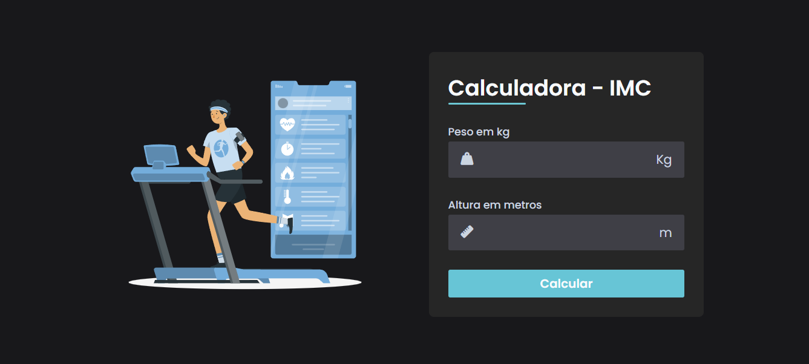
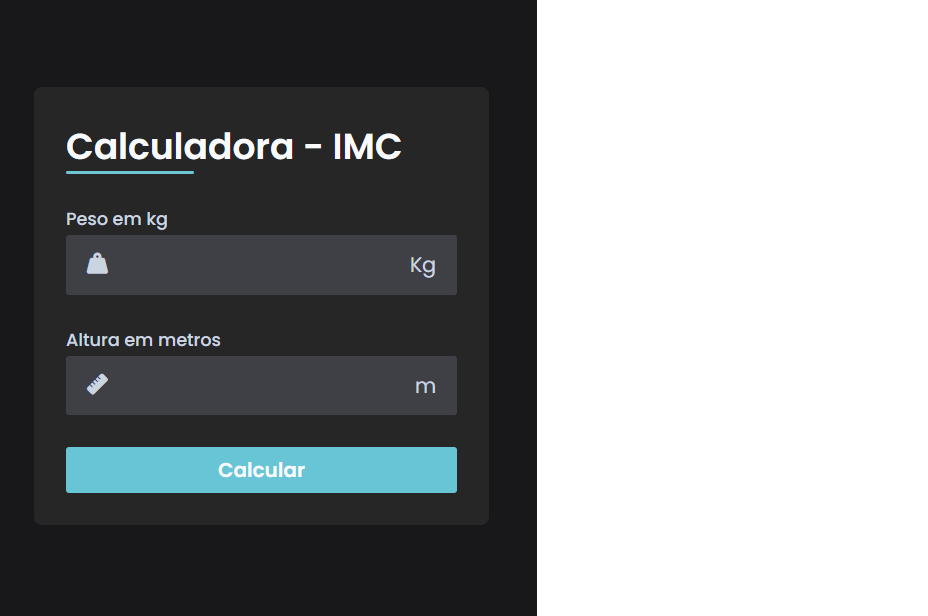

Calculadora de IMC Responsiva

Este é um projeto de uma calculadora de Índice de Massa Corporal (IMC) desenvolvida usando HTML, CSS e JavaScript. O IMC é uma medida que avalia o peso corporal em relação à altura e é amplamente utilizado para identificar se uma pessoa está abaixo do peso, com peso normal, com sobrepeso ou obesa.

Funcionalidades

A calculadora de IMC oferece as seguintes funcionalidades:

1. Interface Responsiva: A calculadora é projetada de forma responsiva para se adaptar a diferentes tamanhos de tela, garantindo uma experiência de usuário consistente em dispositivos móveis e desktops.

2. Cálculo Preciso: Com base nos valores de peso e altura fornecidos pelo usuário, a calculadora realiza o cálculo do IMC de acordo com a fórmula padrão.

3. Feedback Visual: Após o cálculo, a calculadora exibe o resultado do IMC juntamente com uma representação visual do nível de peso (abaixo do peso, peso normal, sobrepeso ou obeso), utilizando cores diferentes para facilitar a compreensão.

Tecnologias Utilizadas

O projeto foi desenvolvido utilizando as seguintes tecnologias:

* HTML: Linguagem de marcação utilizada para estruturar e organizar os elementos da calculadora.

* CSS: Linguagem de estilo utilizada para definir a aparência e o layout da calculadora, incluindo o design responsivo.

* JavaScript: Linguagem de programação utilizada para implementar as funcionalidades interativas da calculadora, como o cálculo do IMC e a exibição dos resultados.

Como Utilizar

1. Para utilizar a calculadora de IMC, siga os passos abaixo:

2. Clone ou faça o download deste repositório para o seu computador.

3. Abra o arquivo index.html em um navegador web compatível.

4. Preencha os campos de peso e altura com os valores desejados.

5. Clique no botão "Calcular" para obter o resultado do IMC.

Visualização da Página

Aqui está uma captura de tela que mostra como a página da calculadora de IMC pode ser visualizada:

Contribuição

Sinta-se à vontade para contribuir com melhorias para esta calculadora de IMC. Se você tiver alguma sugestão, correção de bugs ou novas funcionalidades, fique à vontade para abrir uma "issue" ou enviar uma solicitação de pull.

Espero que esta calculadora de IMC seja útil e ajude a conscientizar sobre a importância de uma vida saudável.
